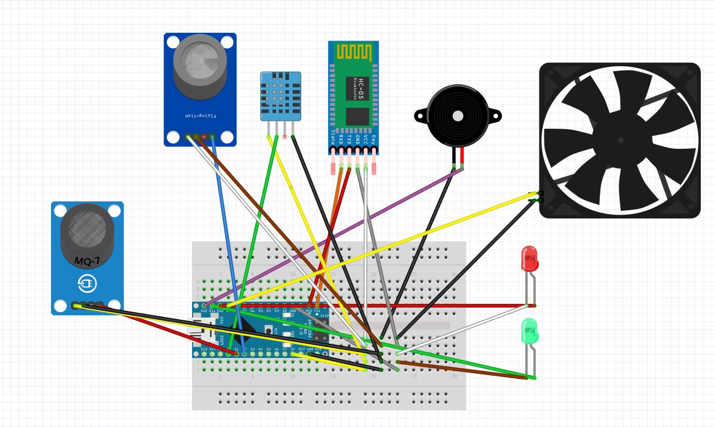

# Air-Quality-Monitoring-System
The Air Quality Monitoring System was developed as a part of the Design with Micro-processors laboratory. The motivation behind this project stems from the increasing concern
over air quality and the need for an accessible and efficient monitoring solution. The system
aims to provide real-time data on air quality parameters such as CO levels, gas concentrations,
temperature and humidity, coupled with user-friendly recommendations and alerts.  

# Hardware
The circuit of the hardware parts and the connections can be seen below:

